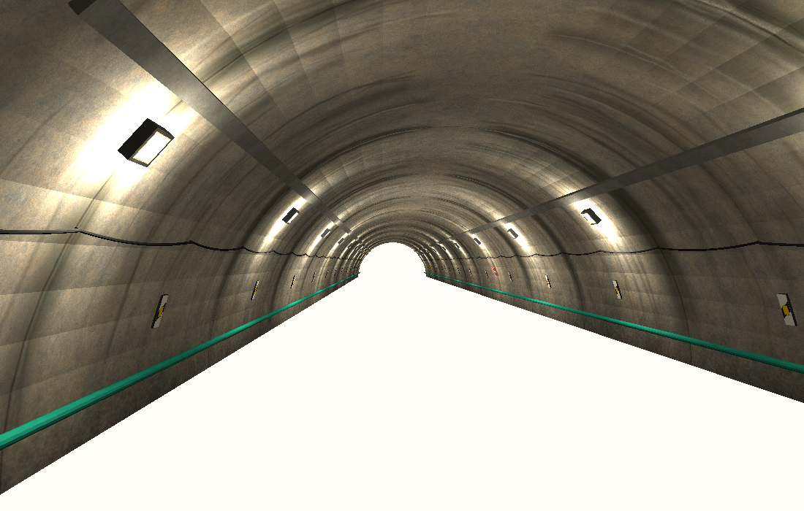
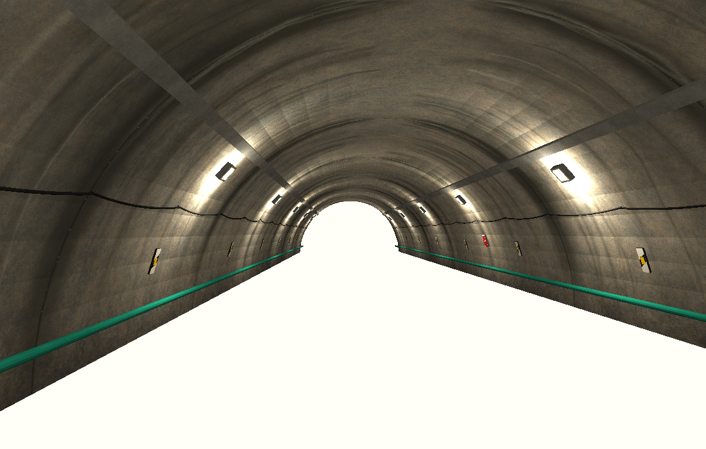
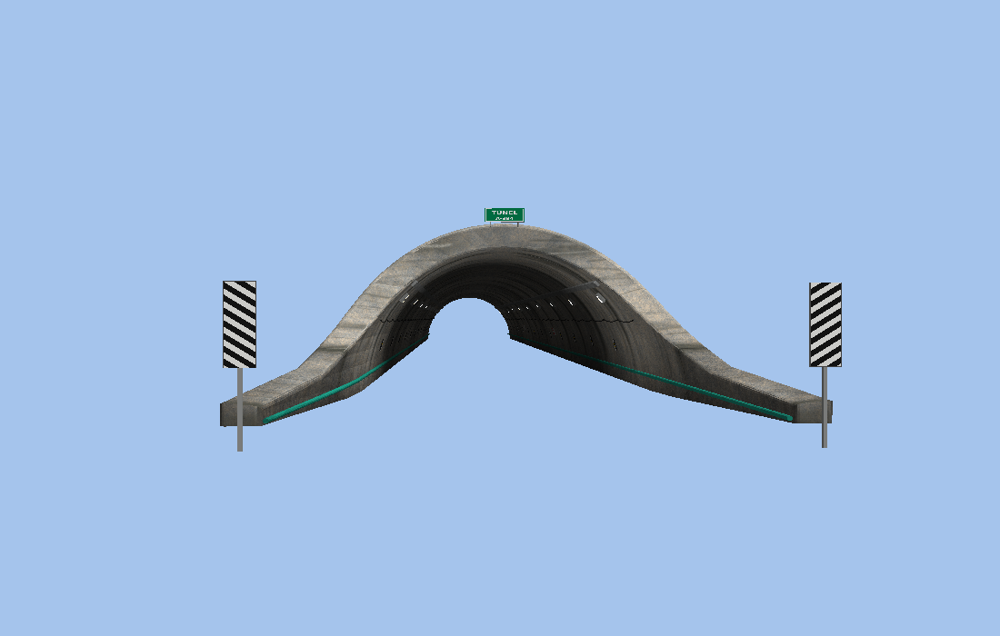

# A-384 tunnel string object (Assetto Corsa / Race Track Builder)

The tunnel pieces dressed to look like the A-384 tunnels near Algodonales:
stained shotcrete lining, wall lights, cable tray and cables, delineators, an
SOS plate, green handrails, chevron edge boards at the portal, and a green
tunnel plate on the crown.





The previews come from a simple software renderer with flat shading. The
floor shows as blank because the pieces contain no road. The scene is end
piece + 2 centre pieces + an end piece turned 180°. The previews show placement, texturing and seams, not what AC will look like.

## Files

| File | What it is |
|---|---|
| `tunnel_end_a384.fbx` | Portal / end piece. The barrel starts at Z = 0 and the portal is at +Z |
| `tunnel_center_a384.fbx` | Repeating centre piece, Z = −726.99 … 0.83 (L = 727.82″ = 18.49 m) |
| `tunnel_concrete.png` | Lining albedo, 2048 × 4096. u goes around the arch and v covers one centre piece |
| `tunnel_concrete_nm.png` | Matching normal map (optional) |
| `tunnel_rail_green.png` | Handrail paint |
| `tunnel_lamp_body.png` / `tunnel_lamp_lens.png` | Lamp housing / lens (lens is emissive) |
| `tunnel_signs.png` | Atlas: chevron board, delineator, SOS, green plate, solid black/grey |
| `ext_config_tunnel.ini` | CSP snippet: emissive lenses plus one light per lamp |
| `tools/` | Scripts and the original FBX files used to produce everything above |

Keep the PNGs in the same folder as the FBX files. The texture paths are relative.

## Seams

Both pieces measure every feature as a distance *d* from the seam they share
(centre: `z = 0.83 − d`, end: `z = d`):

* **Texture**: lining UV `v = d / L`. Every seam is at a whole number of v, so the
  concrete continues across centre↔centre and centre↔end joints. The texture tiles
  vertically, and a lining construction joint sits on the seam. The texture rows at
  the seam are left/right symmetric, so an end piece turned 180° at the far end of
  the tunnel also matches.
* **Spacing**: spacings divide L, so the rhythm doesn't jump at a joint:
  * Lights: every L/3 ≈ 6.2 m, starting L/6 from the seam. That gives 3 per wall per centre piece and 2 per wall on the end piece.
  * Delineators: every L/4 ≈ 4.6 m.
  * Cable hooks: every L/8 ≈ 2.3 m.
* **Continuous parts** (cable tray, cables, handrail): these run exactly seam to seam.
  Both walls use the same heights, so a turned-around piece lines up as well.

## What's in each piece

* `tunnel_shell`: your lining, with new UVs (cylindrical around the arch and planar on the caps and portal cut).
* `tunnel_handrail`: your handrail (green paint).
* `tunnel_light_body`, `tunnel_light_lens_L01…/R01…`: square-ish luminaires (~30 × 28 cm) at the height/angle of your light nulls. Each lens is its own mesh so CSP can put a light on each one.
* `tunnel_cable_tray`, `tunnel_cables`.
* `tunnel_delineators`: white plates with a black diagonal band and a yellow reflector (photo 4), about 1 m above the road.
* `tunnel_sos` (centre only): red SOS plate.
* `tunnel_portal_signs`, `tunnel_name_plate` (end only).

The center source file had its own light fixtures (Material #28/#26, every 53″).
They are replaced by the new lights. The `light` nulls of the end piece are not
carried over. Materials have clear names now (`tunnel_concrete`,
`tunnel_rail_green`, …) instead of `Material #25/#27`.

## Materials in RTB / ksEditor

| Material | Suggested AC shader |
|---|---|
| `tunnel_concrete` | ksPerPixelNM with `tunnel_concrete_nm.png` (or ksPerPixel without it), low specular |
| `tunnel_rail_green` | ksPerPixel |
| `tunnel_lamp_body` | ksPerPixel |
| `tunnel_lamp_lens` | ksPerPixel with `ksEmissive` ≈ 30,26,18 (or let the CSP snippet set it) |
| `tunnel_signs` | ksPerPixel |

If the bumps look inverted, flip the green channel of the normal map.

## Regenerating

Needs `numpy`, `Pillow` and `assimp-py` (`pip install numpy pillow assimp-py`).

```
python3 tools/gen_concrete.py .     # lining albedo + normal map (~1 min)
python3 tools/gen_textures.py .     # signs atlas, rail, lamp textures + tools/atlas.json
python3 tools/build.py end    tools/tunnel_original.fbx        tunnel_end_a384.fbx    tools/atlas.json
python3 tools/build.py center tools/tunnel_center_original.fbx tunnel_center_a384.fbx tools/atlas.json
```

To change spacing and sizes, edit the constants in `tools/build.py`: `LIGHT_STEP`, `HL/HW`, `DELI_STEP`, `HOOK`.
Stain amount and streak counts are in `tools/gen_concrete.py` (the `streams(...)` calls).
To keep the pieces seamless, keep the spacings as whole divisions of L.
